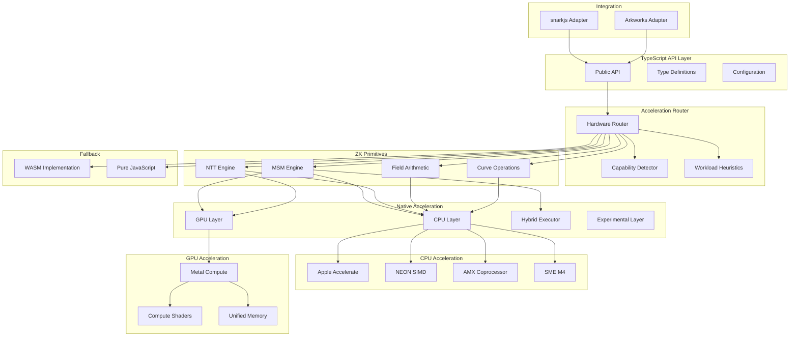

# Design Document: @digitaldefiance/node-zk-accelerate

## Overview

`@digitaldefiance/node-zk-accelerate` is a Zero-Knowledge Proof acceleration library that maximizes Apple Silicon M4 Max hardware utilization. The library provides hardware-accelerated implementations of MSM, NTT, finite field arithmetic, and elliptic curve operations, targeting 10x+ speedups over JavaScript/WASM implementations.

The architecture follows a layered approach:
1. **TypeScript API Layer** - Clean, type-safe interface for developers
2. **Acceleration Router** - Selects optimal hardware path based on input size and availability
3. **Native Acceleration Layers** - CPU (Accelerate/NEON/AMX/SME), GPU (Metal), and hybrid execution
4. **Fallback Layer** - WASM implementations for non-Apple-Silicon platforms

The library reuses components from `@digitaldefiance/node-fhe-accelerate` wherever possible, particularly for finite field arithmetic, NTT foundations, and Metal infrastructure.

## Architecture



## Components and Interfaces

### Core Interfaces

```typescript
// Field element representation
interface FieldElement {
  readonly limbs: BigUint64Array;  // Montgomery representation
  readonly field: FieldConfig;
}

interface FieldConfig {
  readonly modulus: bigint;
  readonly r: bigint;           // Montgomery R = 2^256 mod p
  readonly rInv: bigint;        // R^-1 mod p
  readonly r2: bigint;          // R^2 mod p for conversion
  readonly limbCount: number;
}

// Curve point representations
interface AffinePoint {
  readonly x: FieldElement;
  readonly y: FieldElement;
  readonly isInfinity: boolean;
}

interface ProjectivePoint {
  readonly x: FieldElement;
  readonly y: FieldElement;
  readonly z: FieldElement;
}

interface JacobianPoint {
  readonly x: FieldElement;
  readonly y: FieldElement;
  readonly z: FieldElement;
}

type CurvePoint = AffinePoint | ProjectivePoint | JacobianPoint;

// Curve configuration
interface CurveConfig {
  readonly name: 'BN254' | 'BLS12_381';
  readonly field: FieldConfig;
  readonly a: FieldElement;     // Curve parameter a in y² = x³ + ax + b
  readonly b: FieldElement;     // Curve parameter b
  readonly generator: AffinePoint;
  readonly order: bigint;       // Subgroup order
}

// Scalar representation
interface Scalar {
  readonly value: bigint;
  readonly curve: CurveConfig;
}
```

### MSM Engine Interface

```typescript
interface MSMEngine {
  // Core MSM computation
  msm(
    scalars: Scalar[],
    points: CurvePoint[],
    options?: MSMOptions
  ): Promise<CurvePoint>;

  // Batch MSM for multiple independent computations
  batchMsm(
    batches: Array<{ scalars: Scalar[]; points: CurvePoint[] }>,
    options?: MSMOptions
  ): Promise<CurvePoint[]>;
}

interface MSMOptions {
  curve?: 'BN254' | 'BLS12_381';
  accelerationHint?: 'cpu' | 'gpu' | 'hybrid' | 'auto';
  windowSize?: number;          // Pippenger window size
  gpuThreshold?: number;        // Min points for GPU dispatch
  validateInputs?: boolean;     // Enable/disable input validation
}
```

### NTT Engine Interface

```typescript
interface NTTEngine {
  // Forward NTT
  forwardNtt(
    coefficients: FieldElement[],
    options?: NTTOptions
  ): Promise<FieldElement[]>;

  // Inverse NTT
  inverseNtt(
    values: FieldElement[],
    options?: NTTOptions
  ): Promise<FieldElement[]>;

  // Batch NTT for multiple polynomials
  batchNtt(
    polynomials: FieldElement[][],
    direction: 'forward' | 'inverse',
    options?: NTTOptions
  ): Promise<FieldElement[][]>;
}

interface NTTOptions {
  radix?: 2 | 4;
  inPlace?: boolean;
  accelerationHint?: 'cpu' | 'gpu' | 'auto';
}
```

### Field Arithmetic Interface

```typescript
interface FieldArithmetic {
  // Basic operations
  add(a: FieldElement, b: FieldElement): FieldElement;
  sub(a: FieldElement, b: FieldElement): FieldElement;
  mul(a: FieldElement, b: FieldElement): FieldElement;
  inv(a: FieldElement): FieldElement;
  neg(a: FieldElement): FieldElement;

  // Batch operations
  batchInv(elements: FieldElement[]): FieldElement[];
  batchMul(pairs: Array<[FieldElement, FieldElement]>): FieldElement[];

  // Conversion
  fromBigInt(value: bigint, field: FieldConfig): FieldElement;
  toBigInt(element: FieldElement): bigint;
  fromBytes(bytes: Uint8Array, field: FieldConfig, endian?: 'be' | 'le'): FieldElement;
  toBytes(element: FieldElement, endian?: 'be' | 'le'): Uint8Array;
}
```

### Curve Operations Interface

```typescript
interface CurveOperations {
  // Point arithmetic
  add(p1: CurvePoint, p2: CurvePoint): CurvePoint;
  double(p: CurvePoint): CurvePoint;
  scalarMul(scalar: Scalar, point: CurvePoint): CurvePoint;
  negate(p: CurvePoint): CurvePoint;

  // Coordinate conversion
  toAffine(p: CurvePoint): AffinePoint;
  toProjective(p: CurvePoint): ProjectivePoint;
  toJacobian(p: CurvePoint): JacobianPoint;

  // Compression
  compress(p: AffinePoint): Uint8Array;
  decompress(bytes: Uint8Array, curve: CurveConfig): AffinePoint;

  // Validation
  isOnCurve(p: CurvePoint): boolean;
  isIdentity(p: CurvePoint): boolean;
}
```

### Hardware Acceleration Interfaces

```typescript
interface HardwareCapabilities {
  readonly hasNeon: boolean;
  readonly hasAmx: boolean;
  readonly hasSme: boolean;
  readonly hasMetal: boolean;
  readonly metalDeviceName?: string;
  readonly metalMaxThreadsPerGroup?: number;
  readonly unifiedMemory: boolean;
  readonly cpuCores: number;
  readonly gpuCores?: number;
}

interface AccelerationRouter {
  detectCapabilities(): HardwareCapabilities;
  selectAccelerator(
    operation: 'msm' | 'ntt' | 'field' | 'curve',
    inputSize: number,
    hint?: 'cpu' | 'gpu' | 'hybrid' | 'auto'
  ): 'cpu' | 'gpu' | 'hybrid' | 'wasm';
}

interface CPUAccelerator {
  // vDSP operations
  vectorAdd(a: Float64Array, b: Float64Array): Float64Array;
  vectorMul(a: Float64Array, b: Float64Array): Float64Array;

  // NEON Montgomery multiplication
  montgomeryMul(a: BigUint64Array, b: BigUint64Array, config: FieldConfig): BigUint64Array;
  batchMontgomeryMul(pairs: Array<[BigUint64Array, BigUint64Array]>, config: FieldConfig): BigUint64Array[];

  // AMX/SME matrix operations
  matrixAccumulate(buckets: Float64Array[], points: Float64Array[]): Float64Array;
}

interface GPUAccelerator {
  // Initialization
  initialize(): Promise<void>;
  isAvailable(): boolean;

  // MSM operations
  msmGpu(scalars: Uint8Array, points: Uint8Array, curve: CurveConfig): Promise<Uint8Array>;

  // NTT operations
  nttGpu(coefficients: Uint8Array, direction: 'forward' | 'inverse', config: NTTConfig): Promise<Uint8Array>;

  // Buffer management
  allocateBuffer(size: number): GPUBuffer;
  freeBuffer(buffer: GPUBuffer): void;
}

interface HybridExecutor {
  // Split workload between CPU and GPU
  executeMsm(
    scalars: Scalar[],
    points: CurvePoint[],
    splitRatio?: number  // 0-1, portion for GPU
  ): Promise<CurvePoint>;

  // Benchmark and learn optimal split
  calibrate(sampleSize: number): Promise<{ optimalSplit: number; cpuTime: number; gpuTime: number }>;
}
```

### Integration Adapters

```typescript
interface SnarkjsAdapter {
  // Drop-in acceleration for snarkjs
  accelerateGroth16Prove(
    zkey: Uint8Array,
    wtns: Uint8Array
  ): Promise<{ proof: object; publicSignals: string[] }>;

  acceleratePlonkProve(
    zkey: Uint8Array,
    wtns: Uint8Array
  ): Promise<{ proof: object; publicSignals: string[] }>;

  // File parsing
  parseZkey(data: Uint8Array): ZkeyData;
  parseWtns(data: Uint8Array): WitnessData;
  parseR1cs(data: Uint8Array): R1csData;
}

interface ArkworksAdapter {
  // Serialization compatible with Arkworks
  serializePoint(point: AffinePoint, curve: CurveConfig): Uint8Array;
  deserializePoint(bytes: Uint8Array, curve: CurveConfig): AffinePoint;
  serializeFieldElement(element: FieldElement): Uint8Array;
  deserializeFieldElement(bytes: Uint8Array, field: FieldConfig): FieldElement;
}
```

## Data Models

### Field Element Storage

Field elements are stored in Montgomery representation using 64-bit limbs:

```typescript
// BN254 field element: 254 bits → 4 limbs
const BN254_FIELD: FieldConfig = {
  modulus: 21888242871839275222246405745257275088696311157297823662689037894645226208583n,
  r: 6350874878119819312338956282401532410528162663560392320966563075034087161851n,
  rInv: 20988524275117001072002809824448087578619730785600314334253784976379291040311n,
  r2: 3096616502983703923843567936837374451735540968419076528771170197431451843209n,
  limbCount: 4
};

// BLS12-381 field element: 381 bits → 6 limbs
const BLS12_381_FIELD: FieldConfig = {
  modulus: 4002409555221667393417789825735904156556882819939007885332058136124031650490837864442687629129015664037894272559787n,
  r: 3380320199399472671518931668520476396067793891014375699959770179129436917079669831430077592723774664465579537268733n,
  rInv: 1n, // Computed at runtime
  r2: 2708263910654730174793787626328176511836455197166317677006154293982164122222515399004018013397331347120527951271750n,
  limbCount: 6
};
```

### Curve Point Storage

```typescript
// Affine coordinates (for input/output)
interface AffinePointData {
  x: BigUint64Array;  // Field element limbs
  y: BigUint64Array;
  infinity: boolean;
}

// Jacobian coordinates (for internal computation)
// (X, Y, Z) represents affine (X/Z², Y/Z³)
interface JacobianPointData {
  x: BigUint64Array;
  y: BigUint64Array;
  z: BigUint64Array;
}

// Projective coordinates (alternative internal representation)
// (X, Y, Z) represents affine (X/Z, Y/Z)
interface ProjectivePointData {
  x: BigUint64Array;
  y: BigUint64Array;
  z: BigUint64Array;
}
```

### MSM Bucket Structure

For Pippenger's algorithm with bucket method:

```typescript
interface PippengerState {
  windowSize: number;           // Bits per window (typically 15-20)
  numWindows: number;           // ceil(scalarBits / windowSize)
  bucketsPerWindow: number;     // 2^windowSize - 1
  buckets: JacobianPointData[][]; // [window][bucket] → accumulated point
}

// Sparse matrix representation for GPU MSM
interface SparseMSMMatrix {
  rowIndices: Uint32Array;      // Point indices
  colIndices: Uint32Array;      // Bucket indices
  windowIndex: number;
  nnz: number;                  // Number of non-zeros
}
```

### NTT Configuration

```typescript
interface NTTConfig {
  n: number;                    // Transform size (power of 2)
  field: FieldConfig;
  omega: FieldElement;          // Primitive n-th root of unity
  omegaInv: FieldElement;       // Inverse of omega
  nInv: FieldElement;           // n^-1 mod p for inverse NTT
  twiddles: FieldElement[];     // Precomputed twiddle factors
  twiddlesInv: FieldElement[];  // Inverse twiddle factors
}

// Precomputed NTT tables for common sizes
const NTT_TABLES: Map<number, NTTConfig> = new Map();
```

### Benchmark Data

```typescript
interface BenchmarkResult {
  operation: 'msm' | 'ntt' | 'field_mul' | 'point_add';
  inputSize: number;
  curve?: 'BN254' | 'BLS12_381';
  accelerator: 'cpu' | 'gpu' | 'hybrid' | 'wasm';
  timeMs: number;
  throughput: number;           // ops/sec or points/sec
  speedupVsBaseline: number;
  hardwareUtilization?: {
    cpuPercent: number;
    gpuPercent?: number;
    amxActive?: boolean;
    smeActive?: boolean;
  };
  powerWatts?: number;
}

interface BenchmarkSuite {
  timestamp: string;
  hardware: HardwareCapabilities;
  results: BenchmarkResult[];
  baseline: 'snarkjs-wasm';
}
```

### Native Binding Data Transfer

```typescript
// Efficient data transfer between JS and native code
interface NativeBuffer {
  ptr: number;                  // Pointer to native memory
  size: number;                 // Size in bytes
  type: 'field' | 'point' | 'scalar';
}

// Batch transfer for MSM
interface MSMBatch {
  scalarsBuffer: NativeBuffer;
  pointsBuffer: NativeBuffer;
  count: number;
  curve: 'BN254' | 'BLS12_381';
}
```


## Correctness Properties

*A property is a characteristic or behavior that should hold true across all valid executions of a system—essentially, a formal statement about what the system should do. Properties serve as the bridge between human-readable specifications and machine-verifiable correctness guarantees.*

### Property 1: MSM Correctness

*For any* array of n scalars [s₁, s₂, ..., sₙ] and corresponding curve points [P₁, P₂, ..., Pₙ], the MSM result SHALL equal the sum of individual scalar multiplications: MSM(scalars, points) = Σ(sᵢ · Pᵢ).

**Validates: Requirements 2.1, 2.2, 2.3**

### Property 2: MSM Invalid Input Handling

*For any* array containing at least one point not on the specified curve, calling MSM SHALL return an error rather than producing an incorrect result or crashing.

**Validates: Requirements 2.10**

### Property 3: NTT Round-Trip

*For any* valid polynomial coefficient array of length 2^k, applying forward_ntt followed by inverse_ntt SHALL produce the original coefficient array (within floating-point tolerance for the field).

**Validates: Requirements 3.1, 3.2, 3.9**

### Property 4: NTT Implementation Consistency

*For any* valid polynomial, the NTT result SHALL be identical regardless of:
- Radix used (radix-2 vs radix-4)
- Batch processing (single vs batch_ntt)
- Hardware acceleration path (CPU vs GPU)

**Validates: Requirements 3.3, 3.4**

### Property 5: Field Arithmetic Algebraic Properties

*For any* field elements a, b, c in the configured field:
- Commutativity: field_mul(a, b) = field_mul(b, a)
- Associativity: field_mul(field_mul(a, b), c) = field_mul(a, field_mul(b, c))
- Identity: field_mul(a, 1) = a
- Inverse: For non-zero a, field_mul(a, field_inv(a)) = 1
- Additive inverse: field_add(a, field_neg(a)) = 0

**Validates: Requirements 4.1, 4.2, 4.3, 4.4, 4.9, 4.10**

### Property 6: Batch Inversion Correctness

*For any* array of non-zero field elements, batch_inv SHALL produce the same results as calling field_inv on each element individually.

**Validates: Requirements 4.5**

### Property 7: Field Element Serialization Round-Trip

*For any* valid field element and endianness (big-endian or little-endian), serializing to bytes then deserializing SHALL produce the original field element.

**Validates: Requirements 4.7, 4.8**

### Property 8: Elliptic Curve Group Properties

*For any* valid curve points P, Q, R on the configured curve:
- Identity: point_add(P, identity) = P
- Inverse: point_add(P, point_negate(P)) = identity
- Associativity: point_add(point_add(P, Q), R) = point_add(P, point_add(Q, R))
- Doubling consistency: point_double(P) = point_add(P, P)

**Validates: Requirements 5.1, 5.2, 5.8**

### Property 9: Point Compression Round-Trip

*For any* valid curve point P, compressing then decompressing SHALL produce the original point: point_decompress(point_compress(P)) = P.

**Validates: Requirements 5.5, 5.6, 5.9**

### Property 10: Coordinate Representation Equivalence

*For any* curve point, converting between affine, projective, and Jacobian representations and back to affine SHALL produce the original affine coordinates.

**Validates: Requirements 5.4**

### Property 11: Scalar Multiplication Correctness

*For any* scalar s and curve point P, scalar_mul(s, P) SHALL equal adding P to itself s times (for small s) or follow the double-and-add algorithm correctly.

**Validates: Requirements 5.3**

### Property 12: snarkjs Proof Equivalence

*For any* valid snarkjs inputs (zkey, witness), the accelerated proof generation SHALL produce a proof that:
- Is mathematically identical to the unaccelerated snarkjs proof
- Verifies successfully with the standard snarkjs verifier

**Validates: Requirements 10.6**

### Property 13: Arkworks Serialization Round-Trip

*For any* valid Arkworks-format serialized data (curve points or field elements), deserializing then serializing SHALL produce identical bytes.

**Validates: Requirements 11.1, 11.2, 11.3, 11.4**

### Property 14: Input Validation Correctness

*For any* input data:
- Points not on the curve SHALL be detected and rejected
- Field elements exceeding the modulus SHALL be detected and rejected
- Mismatched array lengths SHALL be detected and reported

**Validates: Requirements 15.2, 15.3, 15.4**

## Error Handling

### Error Categories

```typescript
// Base error class
class ZkAccelerateError extends Error {
  constructor(
    message: string,
    public readonly code: ErrorCode,
    public readonly details?: Record<string, unknown>
  ) {
    super(message);
    this.name = 'ZkAccelerateError';
  }
}

enum ErrorCode {
  // Input validation errors
  INVALID_CURVE_POINT = 'INVALID_CURVE_POINT',
  INVALID_FIELD_ELEMENT = 'INVALID_FIELD_ELEMENT',
  INVALID_SCALAR = 'INVALID_SCALAR',
  ARRAY_LENGTH_MISMATCH = 'ARRAY_LENGTH_MISMATCH',
  INVALID_INPUT_SIZE = 'INVALID_INPUT_SIZE',

  // Arithmetic errors
  DIVISION_BY_ZERO = 'DIVISION_BY_ZERO',
  POINT_AT_INFINITY = 'POINT_AT_INFINITY',

  // Hardware errors
  METAL_UNAVAILABLE = 'METAL_UNAVAILABLE',
  SHADER_COMPILATION_FAILED = 'SHADER_COMPILATION_FAILED',
  GPU_BUFFER_ALLOCATION_FAILED = 'GPU_BUFFER_ALLOCATION_FAILED',
  NATIVE_BINDING_FAILED = 'NATIVE_BINDING_FAILED',

  // File format errors
  INVALID_ZKEY_FORMAT = 'INVALID_ZKEY_FORMAT',
  INVALID_WTNS_FORMAT = 'INVALID_WTNS_FORMAT',
  INVALID_R1CS_FORMAT = 'INVALID_R1CS_FORMAT',
  UNSUPPORTED_CURVE = 'UNSUPPORTED_CURVE',

  // Internal errors
  INTERNAL_ERROR = 'INTERNAL_ERROR',
  FALLBACK_FAILED = 'FALLBACK_FAILED',
}
```

### Error Handling Strategy

1. **Input Validation**: All public API functions validate inputs before computation (unless explicitly disabled for performance)

2. **Hardware Fallback**: When hardware acceleration fails, gracefully fall back to the next available option:
   - SME → AMX → NEON → Accelerate → WASM → Pure JS

3. **Descriptive Messages**: All errors include:
   - Human-readable message
   - Error code for programmatic handling
   - Details object with relevant context (e.g., expected vs actual values)

4. **No Silent Failures**: Operations never return incorrect results silently; they either succeed or throw

### Validation Functions

```typescript
function validateCurvePoint(point: CurvePoint, curve: CurveConfig): void {
  if (isIdentity(point)) return;

  const affine = toAffine(point);
  // Check y² = x³ + ax + b
  const lhs = field.mul(affine.y, affine.y);
  const x3 = field.mul(field.mul(affine.x, affine.x), affine.x);
  const ax = field.mul(curve.a, affine.x);
  const rhs = field.add(field.add(x3, ax), curve.b);

  if (!field.equals(lhs, rhs)) {
    throw new ZkAccelerateError(
      'Point is not on the curve',
      ErrorCode.INVALID_CURVE_POINT,
      { x: affine.x.toString(), y: affine.y.toString(), curve: curve.name }
    );
  }
}

function validateFieldElement(element: FieldElement): void {
  const value = field.toBigInt(element);
  if (value >= element.field.modulus) {
    throw new ZkAccelerateError(
      'Field element exceeds modulus',
      ErrorCode.INVALID_FIELD_ELEMENT,
      { value: value.toString(), modulus: element.field.modulus.toString() }
    );
  }
}

function validateArrayLengths(scalars: Scalar[], points: CurvePoint[]): void {
  if (scalars.length !== points.length) {
    throw new ZkAccelerateError(
      'Scalar and point arrays must have the same length',
      ErrorCode.ARRAY_LENGTH_MISMATCH,
      { scalarsLength: scalars.length, pointsLength: points.length }
    );
  }
}

function validatePowerOfTwo(n: number, operation: string): void {
  if (n <= 0 || (n & (n - 1)) !== 0) {
    throw new ZkAccelerateError(
      `${operation} requires input length to be a power of two`,
      ErrorCode.INVALID_INPUT_SIZE,
      { actualSize: n, suggestion: `Use ${nextPowerOfTwo(n)} instead` }
    );
  }
}
```

## Testing Strategy

### Dual Testing Approach

The library uses both unit tests and property-based tests for comprehensive coverage:

- **Unit tests**: Verify specific examples, edge cases, and error conditions
- **Property tests**: Verify universal properties across randomly generated inputs

### Property-Based Testing Configuration

- **Library**: fast-check (TypeScript property-based testing)
- **Minimum iterations**: 100 per property test
- **Seed**: Configurable for reproducibility
- **Shrinking**: Enabled to find minimal failing examples

### Test Organization

```
tests/
├── unit/
│   ├── field.test.ts       # Field arithmetic unit tests
│   ├── curve.test.ts       # Curve operations unit tests
│   ├── msm.test.ts         # MSM unit tests
│   ├── ntt.test.ts         # NTT unit tests
│   └── adapters.test.ts    # Integration adapter tests
├── property/
│   ├── field.property.ts   # Field arithmetic properties
│   ├── curve.property.ts   # Curve operation properties
│   ├── msm.property.ts     # MSM properties
│   ├── ntt.property.ts     # NTT properties
│   └── serialization.property.ts  # Serialization round-trips
├── integration/
│   ├── snarkjs.test.ts     # snarkjs integration tests
│   └── arkworks.test.ts    # Arkworks compatibility tests
└── benchmarks/
    ├── msm.bench.ts        # MSM benchmarks
    ├── ntt.bench.ts        # NTT benchmarks
    └── comparison.bench.ts # Comparison with snarkjs
```

### Property Test Examples

```typescript
import * as fc from 'fast-check';

// Feature: node-zk-accelerate, Property 3: NTT Round-Trip
describe('NTT Round-Trip Property', () => {
  it('forward then inverse NTT returns original', () => {
    fc.assert(
      fc.property(
        fc.array(arbitraryFieldElement(BN254_FIELD), { minLength: 1, maxLength: 1024 })
          .filter(arr => isPowerOfTwo(arr.length)),
        (coefficients) => {
          const transformed = ntt.forwardNtt(coefficients);
          const recovered = ntt.inverseNtt(transformed);
          return coefficients.every((c, i) => field.equals(c, recovered[i]));
        }
      ),
      { numRuns: 100 }
    );
  });
});

// Feature: node-zk-accelerate, Property 5: Field Arithmetic Algebraic Properties
describe('Field Multiplication Commutativity', () => {
  it('mul(a, b) equals mul(b, a)', () => {
    fc.assert(
      fc.property(
        arbitraryFieldElement(BN254_FIELD),
        arbitraryFieldElement(BN254_FIELD),
        (a, b) => {
          const ab = field.mul(a, b);
          const ba = field.mul(b, a);
          return field.equals(ab, ba);
        }
      ),
      { numRuns: 100 }
    );
  });
});

// Feature: node-zk-accelerate, Property 1: MSM Correctness
describe('MSM Correctness Property', () => {
  it('MSM equals sum of individual scalar multiplications', () => {
    fc.assert(
      fc.property(
        fc.array(
          fc.tuple(arbitraryScalar(BN254), arbitraryCurvePoint(BN254)),
          { minLength: 1, maxLength: 100 }
        ),
        (pairs) => {
          const scalars = pairs.map(([s, _]) => s);
          const points = pairs.map(([_, p]) => p);

          const msmResult = msm.msm(scalars, points);
          const manualResult = pairs.reduce(
            (acc, [s, p]) => curve.add(acc, curve.scalarMul(s, p)),
            curve.identity()
          );

          return curve.equals(msmResult, manualResult);
        }
      ),
      { numRuns: 100 }
    );
  });
});
```

### Arbitrary Generators

```typescript
// Custom generators for property-based testing
function arbitraryFieldElement(config: FieldConfig): fc.Arbitrary<FieldElement> {
  return fc.bigInt({ min: 0n, max: config.modulus - 1n })
    .map(value => field.fromBigInt(value, config));
}

function arbitraryScalar(curve: CurveConfig): fc.Arbitrary<Scalar> {
  return fc.bigInt({ min: 1n, max: curve.order - 1n })
    .map(value => ({ value, curve }));
}

function arbitraryCurvePoint(curve: CurveConfig): fc.Arbitrary<CurvePoint> {
  // Generate valid points by scalar multiplication of generator
  return arbitraryScalar(curve)
    .map(scalar => curveOps.scalarMul(scalar, curve.generator));
}

function arbitraryInvalidCurvePoint(curve: CurveConfig): fc.Arbitrary<AffinePoint> {
  // Generate points NOT on the curve for error testing
  return fc.tuple(
    arbitraryFieldElement(curve.field),
    arbitraryFieldElement(curve.field)
  ).filter(([x, y]) => {
    // Ensure y² ≠ x³ + ax + b
    const lhs = field.mul(y, y);
    const x3 = field.mul(field.mul(x, x), x);
    const ax = field.mul(curve.a, x);
    const rhs = field.add(field.add(x3, ax), curve.b);
    return !field.equals(lhs, rhs);
  }).map(([x, y]) => ({ x, y, isInfinity: false }));
}
```

### Unit Test Coverage

Unit tests focus on:
- Known test vectors from curve specifications
- Edge cases (identity point, zero scalar, maximum values)
- Error conditions (invalid inputs, hardware failures)
- Integration points (snarkjs file parsing, Arkworks format)

### Benchmark Suite

```typescript
// Benchmark configuration
interface BenchmarkConfig {
  sizes: number[];           // Input sizes to test
  iterations: number;        // Iterations per size
  warmup: number;            // Warmup iterations
  baseline: 'snarkjs-wasm';  // Baseline for comparison
}

const MSM_BENCHMARK_CONFIG: BenchmarkConfig = {
  sizes: [1024, 4096, 16384, 65536, 262144, 1048576], // 2^10 to 2^20
  iterations: 10,
  warmup: 2,
  baseline: 'snarkjs-wasm'
};

// Benchmark output format
interface BenchmarkOutput {
  operation: string;
  size: number;
  accelerator: string;
  meanMs: number;
  stddevMs: number;
  minMs: number;
  maxMs: number;
  throughput: number;
  speedupVsBaseline: number;
}
```
